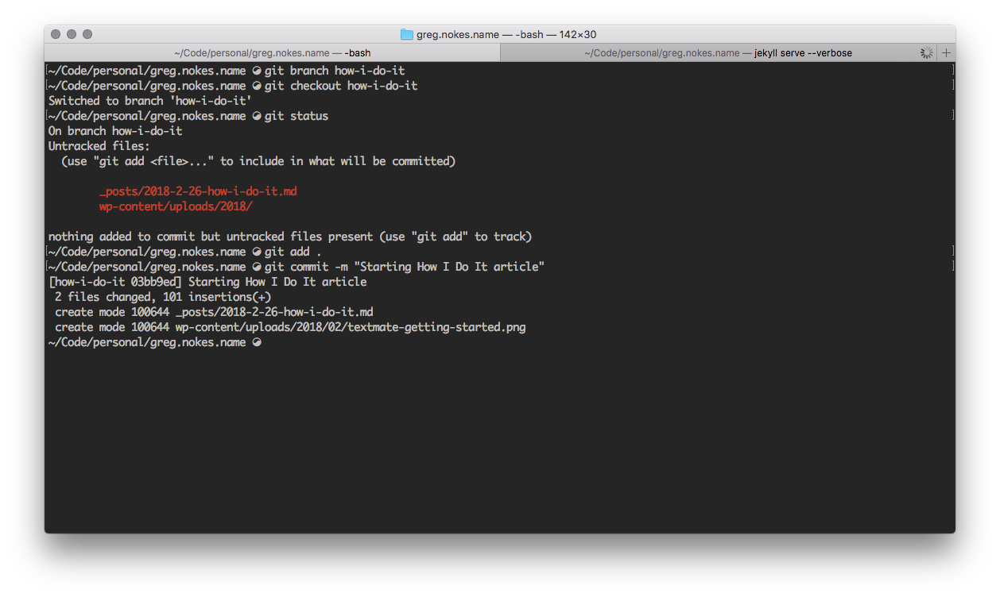
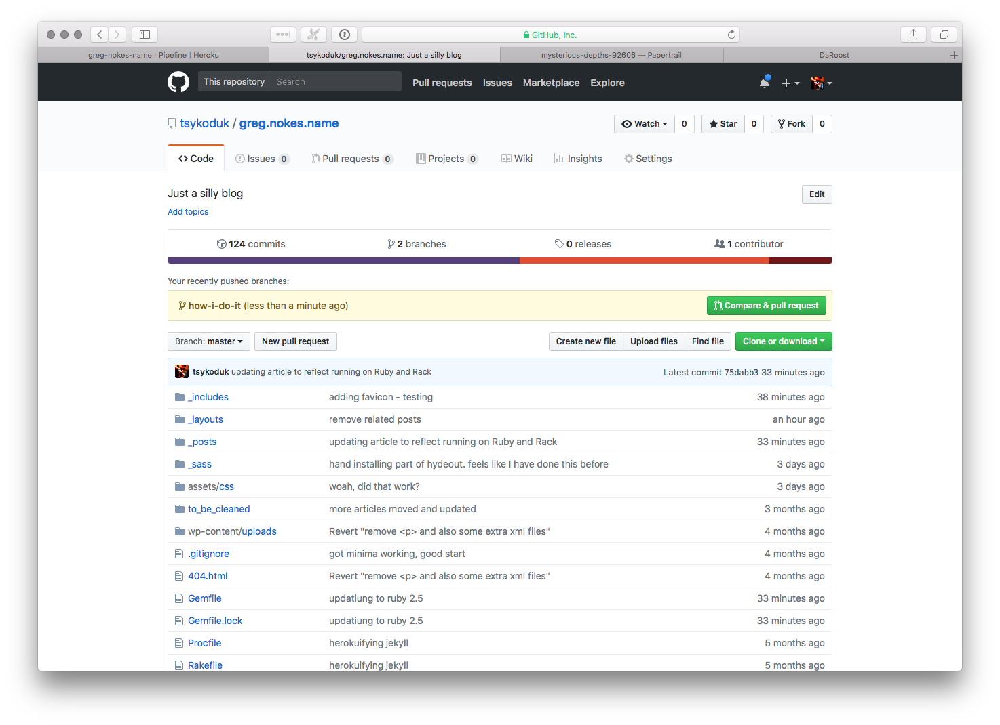
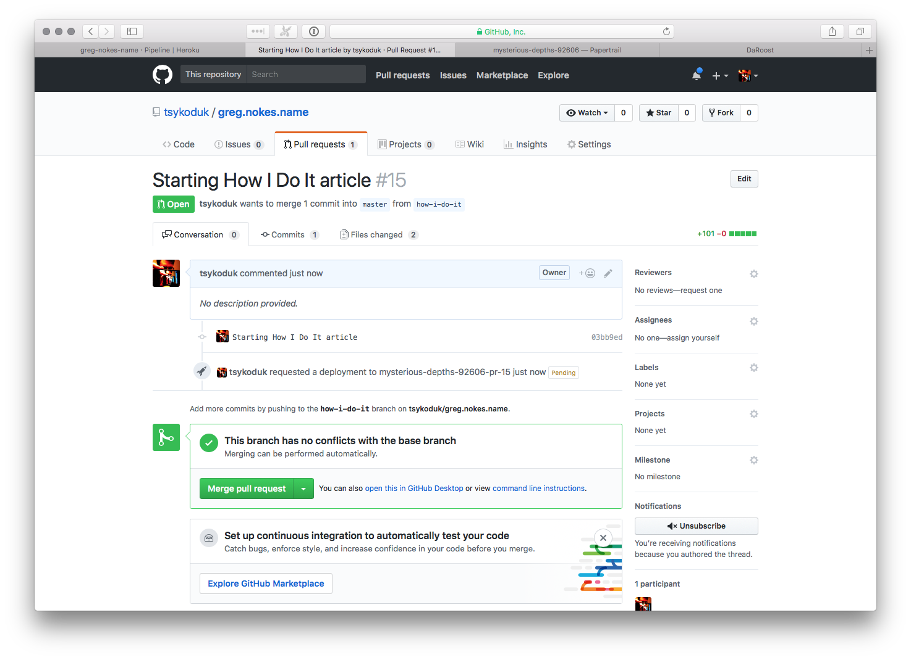
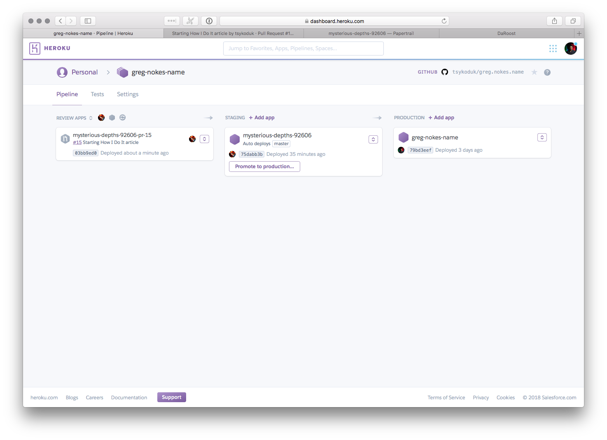

I think that the workflow I have developed for this blog is pretty interesting, so I decided to write up how I currently make the sausage.
<!--more-->

The first step is to write an outline. I currently use Textmate, but I am thinking about trying out Visual Studio, as a few freinds have been gushing about it. On my iPad I will use working copy.

The second step is to create a local branch for the article:

The third step is to create a pull request on Github for this request:

Since I have a pipeline set up on Heroku with review apps enabled, once the PR is opened on Github you will notice that Heroku automatically creates an app tied to that PR.

I can hand out review app to folks that I want to get feedback from. Aslo, as I revise the app and push those changes to my PR, those changes automatically appear in the review app.
