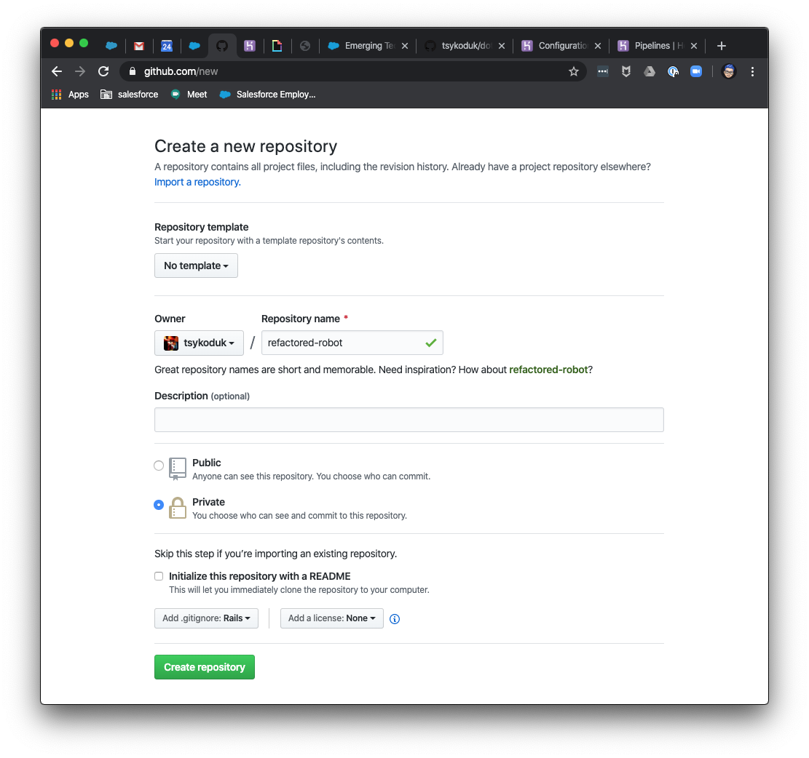
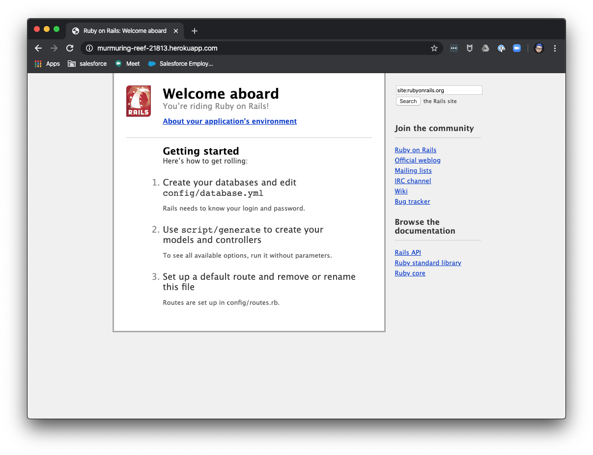
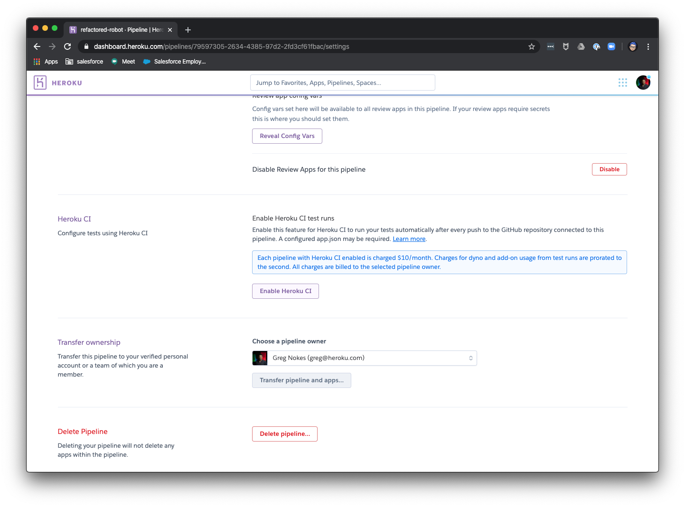

What does it mean “to Heroku”. How do people who use the Platform actually use it? What is a day in the life of a Heroku user? Read on to find out the answers to these and other questions....

**Universal Containers, Day 1**

It was Jane’s first day at Universal Containers (UC). Jane’s expertise was in Ruby on Rails, as she had just graduated from a bootcamp which taught “full stack development” using Rails.

Jane was given the following user stories that she had to solve for on her first project:

* As a consumer of UC information I want to be able to find news and up to date information about the company.
* As a consumer of UC information I want to be able to search older information in a logical fashion
* As a consumer of UC information, I want to be able to view older blog posts in a time series fashion
* I want to be able to deliver this to a potentially very large group of people in an unauthenticated manner, with precise control over the UX

Being a Rails developer, Jane started to formulate a plan based on Rails to serve content to a wide variety of users. She envisioned a rails app, backed by a PostgresSQL database. This would give her an abstraction from having to deal with coding things like an application web server, application request router, and layout engine. All of that and more comes out of the box with Rails!

Jane fired up her tool of choice, Terminal.app, and got started:


Now Jane had a decision to make. Would she build an AWS environment to host her code, or use Heroku? She knew that AWS was the company standard, but she had used Heroku at school, and she really liked it. She talked to Bill Lumbergh, her supervisor, and they decided to see which would be better for this project.

Jane and Bill sat down and built this list to help them make a decision. Bill used his knowledge of AWS, and Jane used her experience with Heroku at Bootcamp.


It appeared that Jane could get the app running a lot quicker on Heroku, so Bill gave her permission to use it.

Jane went to [www.heroku.com](http://www.heroku.com/) and signed up for an account, and downloaded the Heroku CLI to her machine.

She then decided to set up a CI/CD Pipeline to help her with her development work, so she consulted the [devcenter](http://devcenter.heroku.com/) and searched for CI/CD. She found the article on [Heroku CI](https://devcenter.heroku.com/articles/heroku-ci). That was half of the CI/CD problem, but she found a link to [Heroku Pipelines](https://devcenter.heroku.com/articles/pipelines) and that completed the equation for her. 

Using this she would be able to use automated unit tests on her code, and deploy working branches to automatically provisioned and managed development environments! She got to work.

Her first task was to set up her first app. She decided to start with the staging environment, as the production app would be added after User Acceptance Testing (UAT)

She returned to her trusty command line.

She first needed to commit the initial framework of the Rails app to git. Jane knew that using git and Github was a best practice, and it would allow her to leverage advanced Github and Heroku integrations later.

She used the following commands to insure that git was set up correctly, add all of the files, and then commit them locally.

```
~/Code/uc_blog ☯ git status

~/Code/uc_blog ☯ git add .

~/Code/uc_blog ☯ git commit -m "First Commit"
```

She then created a private repository on Github to hold her code:



She added the git remote and pushed her code to Github:

```
~/Code/uc_blog ☯ git remote add origin git@github.com:tsykoduk/refactored-robot.git

~/Code/uc_blog ☯ git pull --allow-unrelated-histories origin master

~/Code/uc_blog ☯ git push origin master
```

Jane was then ready to deploy the skeleton of her application into Heroku. She knew that she would need a build environment to transform her code into an executable format, that she would need containers to run her code, she would need a container orchestrations system to manage the containers and insure they were self healing, and finally she would need load balancers to get web traffic to her app.

```
~/Code/uc_blog ☯ heroku login
heroku: Press any key to open up the browser to login or q to exit: 
Opening browser to https://cli-auth.heroku.com/auth/cli/browser/fed60
Logged in as greg@heroku.com

~/Code/uc_blog ☯ heroku create
Creating app... done, ⬢ murmuring-reef-21813
https://murmuring-reef-21813.herokuapp.com/ | https://git.heroku.com/murmuring-reef-21813.git
```

And that was all there was to that! She had just done all of the work needed to setup the environment to build, run and manage her application. 

Time to grab a cup of coffee!

When Jane got back from meeting some of her new coworkers and getting some coffee, she put her headphones back on. She had a bit to do before lunch!

She decided that she would first deploy the skeleton of the app, and then set up Pipelines and Review Apps, and then hook it all together with Github.

Jane first headed over to the Elements Marketplace, as she knew that her application would need some backing services. She knew that she would need PostgresSQL, and a logging tool. She also chose to install a Redis instance, as she could. use that as a cache with Rails to speed up application performance. With that knowledge in hand, she switched back to her Terminal and issued the following commands:

```
~/Code/uc_blog ☯ heroku addons:create heroku-postgresql:standard-0
Creating heroku-postgresql:standard-0 on ⬢ murmuring-reef-21813... $50/month
The database should be available in 3-5 minutes.
! CAUTION: The database will be empty. If upgrading, you can transfer
!          data from another database with pg:copy.
Use `heroku pg:wait` to track status.
postgresql-defined-69446 is being created in the background. The app will restart when complete...
Use heroku addons:info postgresql-defined-69446 to check creation progress
Use heroku addons:docs heroku-postgresql to view documentation

~/Code/uc_blog ☯ heroku addons:create heroku-redis:premium-0 
Creating heroku-redis:premium-0 on ⬢ murmuring-reef-21813... $15/month
Your add-on should be available in a few minutes.
redis-cubic-39558 is being created in the background. The app will restart when complete...
Use heroku addons:info redis-cubic-39558 to check creation progress
Use heroku addons:docs heroku-redis to view documentation
```

```
~/Code/uc_blog ☯ heroku addons:create papertrail:choklad
Creating papertrail:choklad on ⬢ murmuring-reef-21813... free
Welcome to Papertrail. Questions and ideas are welcome (support@papertrailapp.com). Happy logging!
Created papertrail-acute-05007 as PAPERTRAIL_API_TOKEN
Use heroku addons:docs papertrail to view documentation
```
That would give her new Rails app what it needed to be successful from the start!

Now it was time to package up her code, send it to the build environment, and then move the assembled slug into a container.

```
~/Code/uc_blog ☯ git push heroku master
Enumerating objects: 113, done.
Counting objects: 100% (113/113), done.
Delta compression using up to 8 threads
Compressing objects: 100% (94/94), done.
Writing objects: 100% (113/113), 148.28 KiB | 5.49 MiB/s, done.
Total 113 (delta 9), reused 0 (delta 0)
remote: Compressing source files... done.
remote: Building source:
[...]
remote: -----> Launching...
remote:        Released v8
remote:        https://murmuring-reef-21813.herokuapp.com/ deployed to Heroku
remote: 
remote: Verifying deploy... done.
To https://git.heroku.com/murmuring-reef-21813.git
 * [new branch]      master -> master
```

Her new app was up and running. She opened a web browser and browsed to the new app’s address: https://murmuring-reef-21813.herokuapp.com/



Her final task was to set up the pipeline and development environments. She knew that she would have to create a pipeline, integrate it with GitHub, and enable CI and Review Apps.

She opened the dashboard, and selected the new app. She then selected Create a Pipeline. She then answered a few questions, and the pipeline was created for her. Next on to CI and Review Apps.


Next she clicked on the Enable Review Apps button, and selected a few options


Next, she clicked on Enable CI



All Done. In the course of a single morning, and on her first day at work, Jane had set up a Heroku App and all of the load balancers, build environments, containers, and everything else that comes with running an application on the internet. She had also configured and set up a full CI/CD pipeline including Githib integration.

Now she could roll up her sleeves, and get started building the app. 

But first, Lunch!
