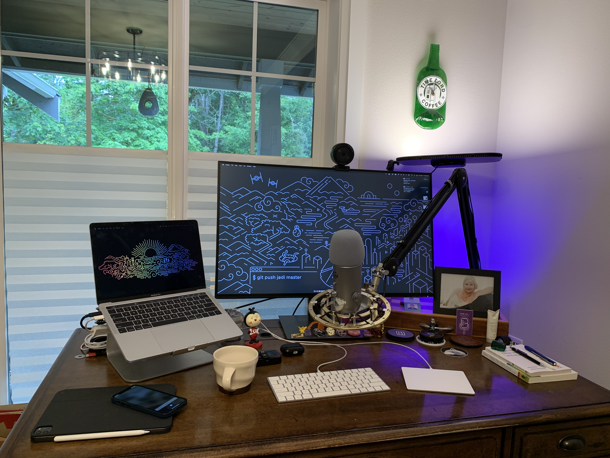

]

I currently use the following gear for my standing desk:

* **Razer Kyo Pro** camera - not the best in the world, but not super expensive and reasonable quality: https://www.razer.com/streaming-cameras/razer-kiyo-pro/RZ19-03640100-R3U1 - hit and miss with Mac - sometimes the camera needs a hard reboot to work.
* **Rain Design M laptop stand** - I’ve had this stand for going on 15 years. It’s a tank: https://www.raindesigninc.com/mstand.html
* **Dell 4K UHD 2160p Monitor** (U3219Q):  Looks like it EOL’d but a solid USB-C driven monitor.
* **Elgato Key Light**: https://www.elgato.com/en/key-light — two (one on each side) would be better, but I have a window in front of me, and Seattle willing sometimes I get natural light ;D
* **Blue Yeti Mic**: [https://www.bluemic.com/en-us/products/yeti](https://www.bluemic.com/en-us/products/yeti/?utm_campaign=dr&utm_source=google&utm_medium=paid_search&cvosrc=ppc.google.%2Bblue%20%2Byeti%20%2Bmicrophone&cvo_campaign=G%20-%20US%20-%20NAM%20-%20Logitech%20Blue%20-%20PS%20-%20Yeti%20-%20BMM&Matchtype=b&cvo_crid=522641314972&partner=DR&category=brand&addisttype=g&gclid=Cj0KCQjwhr2FBhDbARIsACjwLo2ebSWOKeu6sJFFys8NAugg4mbJ5goArdzKdZNe-LmRUkLnpItNwYoaAm5gEALw_wcB)
* **Rode PSA1 Boom**: https://www.rode.com/accessories/stands/psa1
* **Blue Yeti Shockmount** - EOL’d but they have a newer one called a Radius III: https://www.bluemic.com/en-us/accessories/ 
* **Sony MDR7506** Wired Headphones. I have a extension cable running from my mic around to the underside of my desk, and then the headphones plug into that, to keep my desk fairly cable free.
* **VocalBeat Foam Windscreen for Blue Yeti** - the best $15 I have ever spent on my desk AV set up.
* **Caldigit Element USB4 Hub** - https://www.caldigit.com/thunderbolt-4-element-hub/

